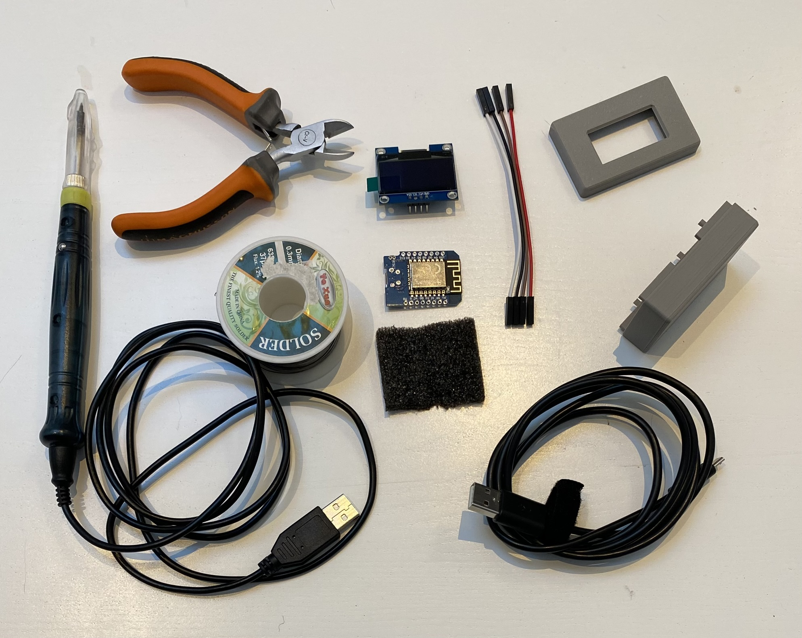
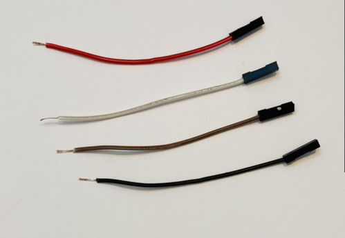
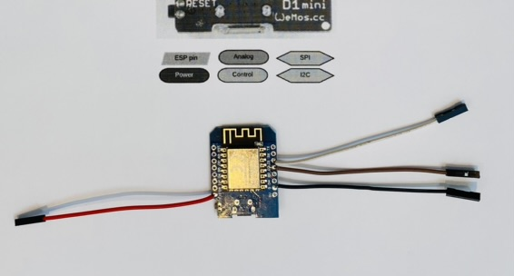
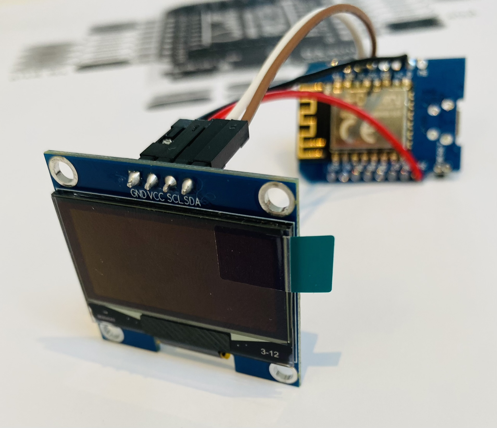
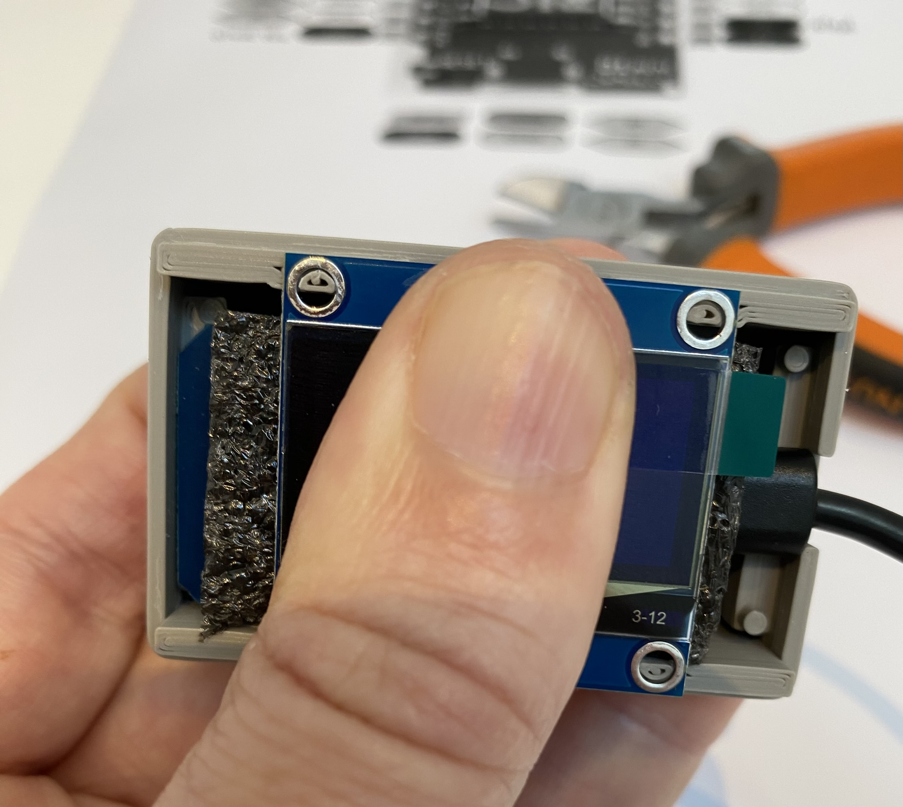
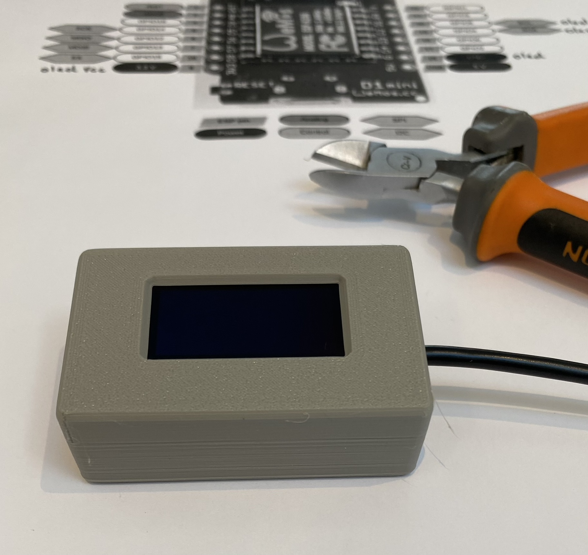

# cryptoDisplay a PIVX Live ticker
A simple crypto display based on a Wemos D1 and an oled screen sh1106

## Bill Of Material
- An IoT board : wimos D1 mini (around 4$) [https://fr.aliexpress.com/item/32647729049.html]
- An Oled screen 1.3" : sh1106 I2C (around 3$) [https://fr.aliexpress.com/item/1005004146596540.html]
- Some wires : female to female 10 cm dupont cable (around 1.5$) [https://fr.aliexpress.com/item/1005004611997111.html]
- A micro usb cable
- Some foam
- A 3d printed case [https://www.thingiverse.com/thing:4657409]

## Tools
- Iron
- Welding wire
- cutting pliers

## Main steps
### Hardware
- Cut one end of for dupont wire

- Solder the four wire to the board (like this)

- Connect Oled screen (like this)

- Test
- Put all in the case (like this)

### Sofware
- Install CH340 drivers
- Install Thonny (microPython IDE)
- Flash microPython firmware on the board (tutorial here)
- Copy main.py and sh1106.py to the board
- Customize main.py with your wifi setting
- Save all on the board

You are done ;-)
